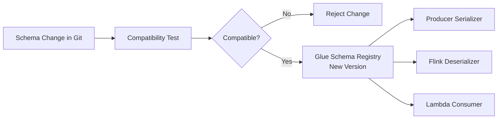
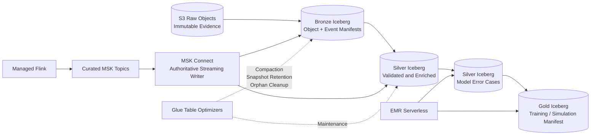
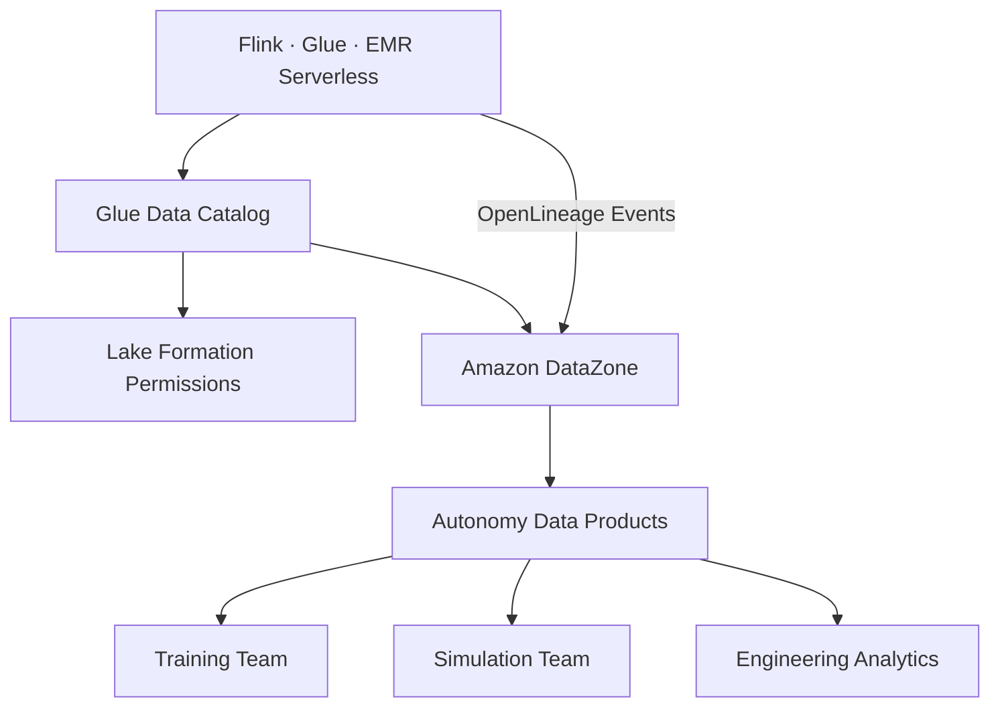
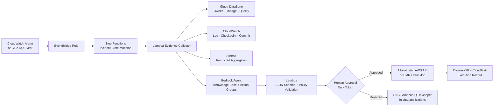
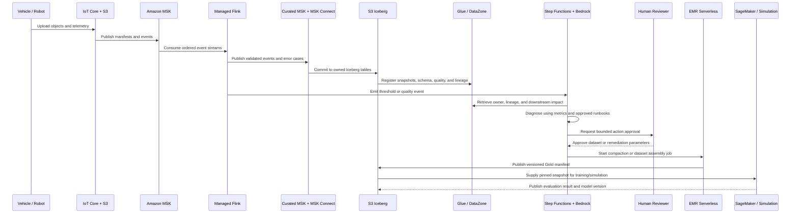
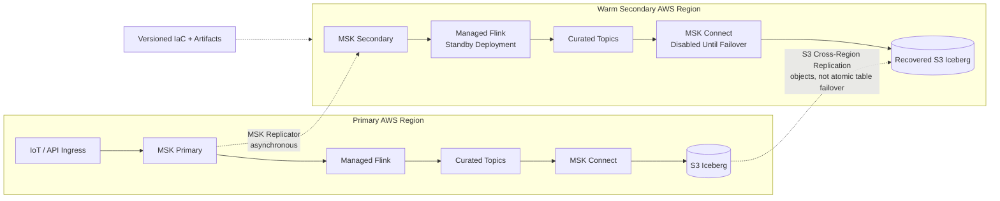
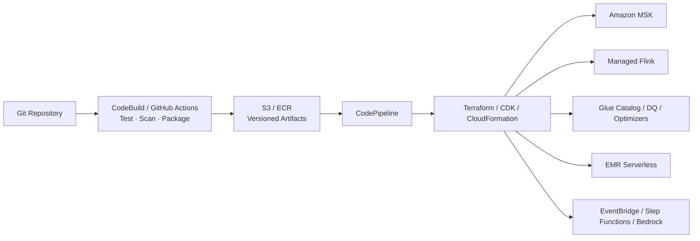

# AWS-Native Autonomous-Driving Data Platform

## Managed and Serverless Streaming, Lakehouse, AI DataOps, and Closed-Loop ML — Without EKS

This document presents an AWS-native alternative to the EKS-based architecture in [`Data_XPENG.md`](Data_XPENG.md). It provides comparable streaming ingestion, real-time processing, Apache Iceberg lakehouse storage, metadata, data quality, lineage, dataset production, AI-assisted operations, and closed-loop model workflows without operating Kubernetes clusters.

The core path is:

> **Vehicle / Robot → AWS IoT Core or Upload API → Amazon MSK → Amazon Managed Service for Apache Flink → Amazon S3 / Apache Iceberg → Amazon EMR Serverless → SageMaker AI training and simulation datasets**

The operating model replaces Kubernetes platform administration with AWS-managed control planes:

- Amazon MSK manages Apache Kafka brokers.
- Amazon MSK Connect manages Kafka Connect workers.
- Amazon Managed Service for Apache Flink runs stateful Flink applications.
- Amazon EMR Serverless or AWS Glue runs Spark processing without persistent clusters.
- AWS Glue Data Catalog and Lake Formation provide metadata and access control.
- Amazon DataZone provides business cataloging and OpenLineage-compatible lineage.
- EventBridge, Step Functions, Lambda, and Amazon Bedrock replace n8n/Dify for a fully AWS-native AI DataOps control plane.

> **Important:** Managed does not mean architecture-free. Partition design, schema compatibility, checkpointing, idempotency, Iceberg file health, service quotas, failure handling, and cost controls still require deliberate engineering.

---

## 1. EKS vs. AWS-Native Service Mapping

| EKS-based component | AWS-native replacement | Operational change |
|---|---|---|
| Strimzi Kafka brokers | Amazon MSK Serverless, Express, or Provisioned | AWS manages brokers, patching, Multi-AZ placement, and service integration. |
| Kafka Connect on EKS | Amazon MSK Connect | AWS manages connector workers, scaling, and recovery. |
| Apache Flink on EKS | Amazon Managed Service for Apache Flink | AWS manages Flink runtime, checkpoints, snapshots, availability, and scaling controls. |
| Spark Operator | Amazon EMR Serverless or AWS Glue ETL | Submit Spark jobs without maintaining Kubernetes nodes or Spark operators. |
| Karpenter + EC2 Spot | EMR Serverless managed capacity | Runtime capacity is allocated and released by the service. |
| Airflow on EKS | Amazon MWAA or AWS Step Functions | Use MWAA for DAG-heavy data orchestration; use Step Functions for event-driven service workflows. |
| OpenMetadata | AWS Glue Data Catalog + Amazon DataZone | Native technical catalog, business catalog, subscriptions, ownership, quality, and lineage. |
| Prometheus / Grafana | Amazon CloudWatch + Amazon Managed Grafana | Native metrics, logs, alarms, dashboards, and cross-account views. |
| Argo CD | CodePipeline / CodeBuild + CloudFormation, CDK, or Terraform | Deploy service configurations and application artifacts without Kubernetes GitOps. |
| Kubernetes secrets | AWS Secrets Manager + KMS | Central secret lifecycle and service-native encryption. |
| n8n | EventBridge + Step Functions + Lambda | Deterministic, auditable, serverless event orchestration. |
| Dify | Amazon Bedrock Agents + Knowledge Bases | AWS-native RAG, action groups, model access, tracing, and guardrails. |

### When the AWS-Native Pattern Is Stronger

- The team wants to minimize Kubernetes and Kafka operational work.
- Workloads can use supported managed-service versions and connectors.
- AWS service integration, IAM, Lake Formation, and centralized governance are priorities.
- The organization accepts managed-service constraints in exchange for reduced undifferentiated operations.
- The platform needs fast delivery with a smaller infrastructure team.

### When EKS May Still Be Stronger

- Custom Kafka, Flink, or Spark plugins require exact runtime control.
- The platform requires portability across clouds or on-premises environments.
- Workloads exceed or conflict with managed-service quotas and version schedules.
- Specialized hardware, networking, sidecars, or operators are fundamental requirements.
- Existing Kubernetes platform capabilities make the incremental operational cost small.

---

## 2. High-Level AWS-Native Architecture

```mermaid
flowchart LR
    subgraph Edge["Vehicle / Robot Edge"]
        Sensor["Camera · LiDAR · Radar<br/>Telemetry · Logs"]
        EdgeAgent["Edge Upload Agent<br/>Buffer · Chunk · Checksum · Retry"]
        Sensor --> EdgeAgent
    end

    subgraph Entry["Secure AWS Ingress"]
        IoT["AWS IoT Core<br/>MQTT Telemetry"]
        API["Amazon API Gateway<br/>Upload Control API"]
        LambdaURL["AWS Lambda<br/>Presigned Multipart URLs"]
        Raw[("Amazon S3<br/>Immutable Sensor Objects")]
        API --> LambdaURL
        LambdaURL --> Raw
    end

    subgraph Stream["Managed Streaming Data Plane"]
        MSK["Amazon MSK<br/>Serverless / Express / Provisioned"]
        Schema["AWS Glue Schema Registry"]
        Flink["Amazon Managed Service<br/>for Apache Flink"]
        Curated["Amazon MSK<br/>Curated Topics"]
        Connect["Amazon MSK Connect<br/>Iceberg Sink / Integrations"]
        IoTBridge["IAM-Authenticated<br/>Producer Lambda"]
        MSK --> Flink
        Schema -. "Contracts" .-> MSK
        Flink --> Curated
        Curated --> Connect
    end

    subgraph Lake["Governed S3 Iceberg Lakehouse"]
        Bronze[("Bronze Iceberg<br/>Raw Event Manifests")]
        Silver[("Silver Iceberg<br/>Validated / Enriched")]
        Errors[("Silver Iceberg<br/>Model Error Cases")]
        Gold[("Gold Iceberg<br/>Training / Simulation Manifests")]
        Catalog["AWS Glue Data Catalog"]
        LF["AWS Lake Formation"]
        Optimizer["Glue Table Optimizers<br/>Compaction · Snapshot · Orphans"]
    end

    subgraph Batch["Serverless Batch and Quality"]
        EMR["Amazon EMR Serverless<br/>Spark ETL / Backfill"]
        GlueDQ["AWS Glue Data Quality"]
        Athena["Amazon Athena"]
    end

    subgraph Governance["Catalog and Lineage"]
        DataZone["Amazon DataZone<br/>Products · Owners · Lineage"]
    end

    subgraph Control["AWS-Native AI DataOps Control Plane"]
        CW["Amazon CloudWatch<br/>Metrics and Alarms"]
        EventBridge["Amazon EventBridge"]
        SFN["AWS Step Functions"]
        Evidence["AWS Lambda<br/>Bounded Evidence APIs"]
        Bedrock["Amazon Bedrock Agent<br/>Knowledge Base · Guardrails"]
        Approval{"Human Approval<br/>Callback Token"}
        SNS["Amazon SNS / Amazon Q Developer<br/>in chat applications"]
    end

    subgraph ML["Autonomy and AI Consumers"]
        SageMaker["Amazon SageMaker AI<br/>Training / Pipelines"]
        Simulation["Simulation and Replay"]
        BI["Redshift / Athena<br/>Engineering Analytics"]
    end

    EdgeAgent --> IoT
    EdgeAgent --> API

    IoT -->|"Provisioned / Express MSK"| MSK
    IoT -. "For MSK Serverless" .-> IoTBridge
    IoTBridge --> MSK

    Connect --> Bronze
    Connect --> Silver
    Connect --> Errors
    Flink -. "Alternative tested<br/>direct Iceberg sink" .-> Silver

    Bronze --> Catalog
    Silver --> Catalog
    Errors --> Catalog
    Gold --> Catalog
    Catalog --> LF
    Catalog --> Optimizer
    Catalog --> DataZone

    EMR <--> Bronze
    EMR <--> Silver
    EMR --> Gold
    GlueDQ --> Silver
    GlueDQ --> Errors
    Athena --> Silver
    Athena --> Gold

    MSK --> CW
    Flink --> CW
    CW --> EventBridge
    GlueDQ --> EventBridge
    EventBridge --> SFN
    SFN --> Evidence
    Evidence --> Bedrock
    DataZone --> Evidence
    Catalog --> Evidence
    Bedrock --> Approval
    Approval -- "Approved" --> SFN
    Approval -- "Review / Reject" --> SNS
    SFN --> EMR
    SFN --> GlueDQ
    SFN --> SNS

    Gold --> SageMaker
    Gold --> Simulation
    Gold --> BI
```



### Recommended Reliable Baseline

For the high-throughput production design, the preferred baseline is intentionally more specific than the general diagram:

```text
AWS IoT Core
→ MSK Express or Provisioned
→ Managed Service for Apache Flink
→ curated MSK topics
→ one MSK Connect Iceberg sink owner per target-table group
→ S3 Iceberg + Glue Data Catalog + Lake Formation
→ EMR Serverless for Gold dataset assembly and specialized maintenance
```

This choice provides clear failure boundaries:

- MSK owns durable event transport and replay.
- Flink owns stateful event-time computation, validation, and error-case classification.
- Curated topics form the replayable contract between processing and storage delivery.
- MSK Connect owns Iceberg commits for its assigned tables.
- EMR Serverless owns batch dataset publication.
- Glue optimizers own routine table maintenance.

The alternative direct Flink-to-Iceberg path is valid when lower latency or atomic checkpoint-coupled table commits are required, but it must pass connector-version, checkpoint-recovery, schema-evolution, and concurrent-writer tests before production use.

### Non-Negotiable Reliability Decisions

1. **One authoritative streaming writer path per Iceberg table.** Do not let Flink, MSK Connect, Firehose, and Glue streaming jobs independently write the same table.
2. **Immutable raw object keys.** Generate content-addressed or unique object keys; never rely on overwriting an existing S3 key during retry.
3. **At-least-once boundaries require idempotency.** Lambda event-source mappings and many service integrations can deliver duplicates.
4. **Exactly-once must be proven end to end.** Flink checkpoint consistency alone does not guarantee exactly-once external side effects unless the selected sink participates correctly.
5. **Gold datasets are published by manifest.** Consumers see a dataset only after quality gates pass and the immutable Iceberg snapshot IDs are recorded.
6. **AI never becomes a data-plane dependency.** A Bedrock or Step Functions outage cannot stop Kafka-to-Iceberg ingestion.
7. **Recovery is tested, not inferred.** The implementation must demonstrate replay, duplicate suppression, checkpoint restore, failed Iceberg commit recovery, and regional failover procedures.

---

## 3. Ingress Design: Telemetry vs. Large Sensor Objects

Large camera, LiDAR, radar, and log objects should not travel as Kafka payloads. The ingress plane separates bulk object transfer from streaming metadata.

### Path A — Large Sensor Objects

1. The edge agent requests an upload session from API Gateway.
2. Lambda authenticates the device or fleet identity and generates narrowly scoped S3 presigned URLs.
3. The edge agent uses multipart upload with checksums and resumable retry.
4. The object key includes a unique upload ID or content hash so a retry cannot overwrite a different object.
5. The completed object is stored in an immutable S3 raw bucket with versioning and the required retention policy.
6. An S3 event or upload-completion API publishes the object manifest to MSK.

The upload-completion operation is idempotent: DynamoDB conditionally records the upload ID, object key, checksum, and manifest-publication state. A retry returns the existing result instead of publishing a second logical object. S3 Object Lock is optional and should be enabled only where evidentiary or regulatory retention requires write-once-read-many controls.

Example object manifest:

```json
{
  "event_id": "evt-01JZXPENG8W1B7V2K5NQ",
  "vehicle_id": "vehicle-1042",
  "capture_time": "2026-07-14T18:30:42.183Z",
  "sensor_type": "camera_front",
  "object_uri": "s3://autonomy-raw/2026/07/14/vehicle-1042/frame-837142.jpg",
  "checksum": "sha256:8fb8...",
  "size_bytes": 8388608,
  "model_version": "perception-v17",
  "frame_id": "frame-837142",
  "schema_version": 1
}
```

### Path B — Telemetry and Operational Events

Vehicles publish small telemetry and inference events through AWS IoT Core over MQTT. AWS IoT Core routes the event toward MSK.

#### Important MSK Constraint

The AWS IoT Core Kafka rule action can send directly to Amazon MSK, but it does **not** support MSK Serverless because MSK Serverless requires IAM authentication.

Use one of these patterns:

| Requirement | Recommended pattern |
|---|---|
| Direct IoT Core → Kafka rule action | MSK Express or Provisioned with a supported authentication method |
| Fully serverless Kafka | IoT Core → Lambda producer in VPC → MSK Serverless using IAM authentication |
| Very high and predictable Kafka throughput | MSK Express or carefully sized Provisioned brokers |
| Spiky development or moderate variable workloads | MSK Serverless, after validating quotas and cost |

The architecture should select a cluster type from measured traffic, partition count, retention, throughput, and cost—not from the word "serverless" alone.

---

## 4. Amazon MSK Design

### Topic Layout

```text
vehicle.telemetry.v1
sensor.object-manifest.v1
perception.inference.v1
perception.error-cases.v1
pipeline.quality-events.v1
pipeline.operations.v1
dataset.training-requests.v1
dataset.training-results.v1
```

### Partitioning

- Hash vehicle or robot ID to preserve local ordering without creating one partition per device.
- Separate high-volume sensor manifests from low-volume operational events.
- Estimate partitions from sustained bytes/sec, records/sec, consumer parallelism, and replay targets.
- Monitor skew and hot partitions by key distribution.
- Treat partition-count increases as controlled production changes because partition changes can affect key ordering.

### Durability and Replay

- Use replication across Availability Zones.
- Enable producer idempotency and use strong acknowledgment settings for critical events.
- Define retention independently by topic and recovery objective.
- Store immutable large objects in S3 so Kafka replay does not depend on multi-megabyte messages.
- Maintain reconciliation between S3 objects, object manifests, and Iceberg records.

### Security

- Use IAM authentication where supported and appropriate.
- Use TLS in transit and KMS encryption at rest.
- Keep brokers in private subnets.
- Use VPC endpoints, security groups, and least-privilege IAM roles.
- Use Secrets Manager for SCRAM credentials when that authentication mode is required.
- Audit administrative API activity with CloudTrail.

---

## 5. AWS Glue Schema Registry

AWS Glue Schema Registry becomes the streaming data-contract layer for MSK producers, Managed Flink consumers, Lambda consumers, and downstream applications.

Supported contract formats include Avro, JSON Schema, and Protobuf.

### Compatibility Policy

- Use backward compatibility for additive producer changes by default.
- Require explicit review for deletions, renames, or semantic type changes.
- Include `schema_version`, `event_id`, event time, and source identity in every event.
- Fail incompatible producer changes before publishing rather than allowing silent consumer breakage.
- Route invalid or unknown records to quarantine with the original payload and failure reason.

### Contract Lifecycle



---

## 6. Amazon Managed Service for Apache Flink

Managed Flink performs stateful real-time processing without a self-managed EKS streaming cluster.

### Responsibilities

1. Consume telemetry, object manifests, and inference records from MSK.
2. Deserialize and validate records against Glue Schema Registry.
3. Apply event-time processing and watermarks for late uploads.
4. Deduplicate using `event_id` and `frame_id` keyed state.
5. Join inference events with model, vehicle, and scenario context.
6. Calculate quality and anomaly windows.
7. Route malformed records to quarantine topics or S3.
8. Produce validated/enriched topics or write Iceberg tables.
9. Emit custom CloudWatch metrics and operational events.

### State and Recovery

- Use durable checkpoints and service snapshots.
- Measure checkpoint duration, checkpoint failure, state size, restart time, and backpressure.
- Test recovery from application failure, MSK partition unavailability, schema rejection, and sink throttling.
- Keep external effects idempotent because recovery may replay records around a failure boundary.
- Version the Flink artifact, connector dependencies, and configuration together.

### Iceberg Integration Options

| Pattern | When to use | Trade-off |
|---|---|---|
| Managed Flink writes Iceberg directly | Stateful enrichment and precise Flink/Iceberg control are required | Application packages and tests compatible Iceberg, AWS, S3, and catalog connector versions. |
| Flink writes curated Kafka topics; MSK Connect writes Iceberg | Separate processing from table delivery | Additional topic and connector, but clearer operational boundaries. |
| Flink writes to Data Firehose; Firehose writes Iceberg | Straightforward managed delivery and routing | Validate regional availability, throughput, update/delete behavior, and delivery limitations. |
| AWS Glue streaming ETL writes Iceberg | Team prefers Spark Structured Streaming and Glue | Higher processing latency may be acceptable; simpler Spark skill alignment. |

For a strong XPENG-aligned demonstration, use Managed Flink for error-case detection and event-time processing, then use either a tested Iceberg sink or a curated Kafka topic with MSK Connect.

For the production baseline in this design, use **curated MSK topics plus MSK Connect**. Treat Data Firehose as a bounded alternative: use only one Firehose stream to write a given Iceberg table, configure an S3 error-output prefix and replay procedure, and verify the chosen source is supported. In particular, Firehose does not support MSK Serverless as a source when the destination is an Iceberg table. Multiple Firehose streams must not compete to commit to the same table because Iceberg optimistic concurrency permits only one successful commit at a time.

### End-to-End Delivery Semantics

"Exactly once" is a property of the complete source-processing-sink path, not a label applied to one service.

| Boundary | Expected behavior | Required control |
|---|---|---|
| Edge upload → S3 | Network retry may repeat requests | Unique immutable object key, checksum, multipart upload ID, and conditional completion record |
| IoT Core rule action | Intermittent failures can cause retry | Immutable `event_id` and downstream deduplication |
| Lambda integration | At-least-once delivery is possible | Idempotent handler and conditional DynamoDB record |
| Kafka producer → MSK | Retry can duplicate without producer controls | Producer idempotency, stable key, acknowledgments, and bounded retry |
| MSK → Managed Flink | Offsets and state restore from checkpoints | Checkpointing, snapshots, stable operator IDs, and tested restore procedure |
| Flink → curated Kafka | Exactly-once requires Kafka transaction support and correct checkpoint configuration | Transactional producer settings and failure-injection testing |
| MSK Connect → Iceberg | Depends on the selected connector and configuration | Pin version, enable supported exactly-once mode, isolate table ownership, and test commit recovery |
| Firehose → Iceberg | Managed retry with failed records routed to S3 | Error bucket, replay procedure, unique keys for updates/deletes, and one stream per table |
| EMR Serverless → Gold | Job retry can repeat a write | Write to a run-specific staging branch/table and publish the manifest only once |

Every stage carries `event_id`, source topic/partition/offset where applicable, upload ID, schema version, model version, and processing-run ID. A reconciliation job compares these identifiers across raw S3 objects, Kafka manifests, Silver records, and Gold manifests.

---

## 7. Amazon MSK Connect

MSK Connect provides managed Kafka Connect workers for source and sink integrations.

### Recommended Uses

- Iceberg sink connector for curated Kafka records
- Change data capture from databases into MSK
- S3 or external-system integration where a mature connector exists
- Lightweight filtering, conversion, and routing

### Production Controls

- Store custom connector plugins in versioned S3 locations.
- Pin connector and Iceberg versions.
- Use separate connectors for workloads with different scaling and failure domains.
- Monitor worker utilization, task failures, retries, commit latency, and rejected records.
- Route failures to durable storage for replay.
- Test exactly-once behavior and table-commit recovery under connector restarts.

MSK Connect should not replace Flink for stateful joins, event-time windows, complex enrichment, or model-error mining.

---

## 8. S3 and Apache Iceberg Lakehouse



### Table Layout

```text
bronze.sensor_object_manifest
bronze.vehicle_telemetry
bronze.perception_inference

silver.validated_telemetry
silver.validated_perception
silver.model_error_cases
silver.quarantined_events

gold.training_dataset_manifest
gold.simulation_scenario_manifest
gold.model_evaluation_metrics
```

### Iceberg Functions to Demonstrate

- Schema evolution
- Partition evolution
- Atomic commits
- Snapshot isolation and time travel
- Concurrent streaming and batch access
- Compaction and file-size management
- Snapshot retention
- Orphan-file deletion
- Reproducible dataset selection by snapshot ID

### Native Table Maintenance

AWS Glue Data Catalog table optimizers can manage:

1. **Compaction:** Merge small files using binpack, sort, or Z-order strategies.
2. **Snapshot retention:** Remove snapshots according to retention and minimum-snapshot policies.
3. **Orphan-file deletion:** Remove unreferenced files after a safe retention window.

Glue managed compaction applies to supported Parquet-backed Iceberg tables. Use EMR Serverless for specialized maintenance, unsupported layouts, or logic that requires custom Spark code; use Glue optimizers for standard recurring maintenance after validating table and regional support.

---

## 9. EMR Serverless and AWS Glue ETL

### Amazon EMR Serverless

Use EMR Serverless Spark for:

- Large backfills and historical reprocessing
- Error-case mining across long time windows
- Training and simulation dataset assembly
- Complex joins and aggregations
- Custom Iceberg maintenance
- Reconciliation between raw objects, Kafka manifests, and lakehouse rows

EMR Serverless supports Iceberg with S3 storage and Glue Data Catalog as the metastore, without maintaining an EMR or EKS cluster.

### AWS Glue ETL

Use Glue ETL for:

- Standard serverless ETL and streaming ETL
- Iceberg read/write and schema evolution
- Data Catalog integration
- Data quality checks in the transformation path
- Workloads already standardized on Glue jobs and DQDL

### Selection Guide

| Requirement | Preferred service |
|---|---|
| Stateful low-latency event processing | Managed Service for Apache Flink |
| Long-running Spark Structured Streaming | EMR Serverless streaming or Glue streaming ETL |
| Complex, elastic Spark batch jobs | EMR Serverless |
| Integrated ETL + Data Catalog + data quality | AWS Glue ETL |
| Standard Iceberg file/snapshot maintenance | Glue Data Catalog table optimizers |

---

## 10. AWS Glue Data Quality

Glue Data Quality provides managed DQDL-based rules for catalog tables and ETL jobs.

### Example Rules

```text
Rules = [
    IsComplete "event_id",
    IsUnique "event_id",
    IsComplete "vehicle_id",
    ColumnValues "confidence" between 0.0 and 1.0,
    ColumnValues "schema_version" in [1, 2],
    DataFreshness "event_time" <= 15 minutes,
    RowCount > 0
]
```

### Failure Handling

1. Evaluate rules against a partition, micro-batch, or candidate dataset.
2. Write failed records to `silver.quarantined_events` or a dedicated S3 failure prefix.
3. Publish results to CloudWatch and EventBridge.
4. Stop Gold dataset publication when blocking rules fail.
5. Start the AI DataOps workflow with rule, table, partition, snapshot, and ownership context.

The quality result is a gate, not just a dashboard metric.

---

## 11. Glue Data Catalog, Lake Formation, and DataZone

### Glue Data Catalog

- Stores Iceberg table and schema metadata.
- Provides a shared catalog for Flink, Spark, Glue, Athena, Redshift, and SageMaker consumers.
- Tracks current snapshot metadata and table properties.
- Integrates with table optimizers and crawlers.

### Lake Formation

- Grants database, table, column, and row-level access where supported.
- Centralizes cross-account data sharing.
- Vends scoped access to governed consumers.
- Separates data ownership from compute-service roles.

### Amazon DataZone

- Publishes business data products.
- Associates owners, descriptions, domains, classifications, and subscription workflows.
- Captures and visualizes OpenLineage-compatible lineage.
- Connects technical Glue assets to business and AI/ML consumers.



---

## 12. AWS-Native AI DataOps Control Plane

The AWS-native control plane replaces n8n and Dify with EventBridge, Step Functions, Lambda, Amazon Bedrock, and human callback tokens.



### Evidence Package

The Lambda evidence collector retrieves only bounded operational context:

```json
{
  "event_type": "ICEBERG_SMALL_FILE_THRESHOLD",
  "severity": "HIGH",
  "table": "silver.model_error_cases",
  "partition_start": "2026-07-14T17:00:00Z",
  "partition_end": "2026-07-14T20:00:00Z",
  "file_count": 12847,
  "average_file_size_mb": 7.4,
  "latest_snapshot_id": 739118221427,
  "downstream_assets": ["gold.training_dataset_manifest"],
  "owner": "autonomy-data-platform",
  "runbook": "s3://ai-dataops-runbooks/iceberg-compaction.md"
}
```

### Bedrock Agent Boundary

The agent can:

- Query the approved knowledge base.
- Request bounded metrics or metadata through defined action groups.
- Summarize probable cause and downstream impact.
- Select an allow-listed remediation template.
- Propose validated parameters for a Step Functions execution.

The agent cannot:

- Access unrestricted raw sensor data.
- Execute arbitrary shell commands or SQL.
- Modify IAM, KMS, Lake Formation, or network policy.
- Delete S3 objects or Iceberg snapshots.
- Start an unapproved job or API action.
- Bypass the Step Functions human-approval state.

### Structured Recommendation

```json
{
  "severity": "HIGH",
  "probable_cause": "Streaming recovery created excessive small files in three partitions",
  "confidence": 0.88,
  "recommended_action": "START_TARGETED_COMPACTION",
  "target_service": "EMR_SERVERLESS",
  "parameters": {
    "table": "silver.model_error_cases",
    "partition_start": "2026-07-14T17:00:00Z",
    "partition_end": "2026-07-14T20:00:00Z"
  },
  "requires_approval": true
}
```

Lambda validates this output against JSON Schema and policy before Step Functions can request approval.

---

## 13. Autonomous-Driving Closed Loop



### Closed-Loop Outcome

The system converts operational and model-error evidence into a reproducible dataset while preserving:

- Source event and object identifiers
- Model version and selection-policy version
- Iceberg source snapshot IDs
- Data-quality result
- Human approval record
- Training or simulation run identifier
- New evaluation result and model version

---

## 14. Orchestration: Step Functions vs. MWAA

| Requirement | Step Functions | Amazon MWAA |
|---|---|---|
| Event-driven service orchestration | Excellent | Possible but not its primary strength |
| Human approval and callback token | Native pattern | Requires custom operator/sensor logic |
| Large graph of data dependencies | Manageable | Strong Airflow fit |
| Existing Airflow DAG investment | Less direct | Best fit |
| AWS SDK service integrations | Strong | Usually implemented through operators/hooks |
| Long-running scheduled data platform | Possible | Strong scheduling and DAG UI |
| Minimal infrastructure operations | Strong serverless model | Managed environment but still an Airflow platform |

Recommended split:

- Use **Step Functions** for incident response, approvals, service API calls, and AI DataOps.
- Use **MWAA** when the organization already standardizes complex dataset dependencies on Airflow.
- Avoid duplicating the same orchestration state across both systems.

---

## 15. Observability and SLOs

### CloudWatch Signals

| Layer | Key signals |
|---|---|
| IoT / ingress | Connection failures, publish failures, upload duration, checksum mismatch |
| MSK | Bytes in/out, consumer lag, partition skew, broker health, storage, throttling |
| Managed Flink | Records in/out, busy time, backpressure, checkpoint duration/failure, restart count |
| MSK Connect | Worker utilization, task failure, retry rate, sink commit latency |
| S3 / Iceberg | Commit latency, file count, average file size, snapshot count, failed commits |
| EMR Serverless | Job duration, worker utilization, shuffle, failure reason, cost |
| Glue Data Quality | Rule pass rate, failed rows, freshness, anomaly result |
| Step Functions | Execution failure, timeout, approval duration, remediation result |
| Bedrock | Invocation error, latency, token usage, guardrail intervention, trace result |

### Example SLO Framework

- Define event-to-Silver freshness at P50, P95, and P99.
- Define maximum acceptable Kafka lag by topic criticality.
- Define checkpoint success and recovery-time objectives for Flink applications.
- Require every Gold dataset to reference immutable source snapshot IDs.
- Require all blocking data-quality rules to pass before publication.
- Require all production AI recommendations to be schema-valid, policy-valid, human-approved, and audited.

Do not publish SLO numbers until tests establish realistic values.

---

## 16. Regional Resilience and Disaster Recovery

Design first for Availability Zone failures inside one Region, then add a warm secondary Region when the business impact justifies it. Define workload-specific recovery point objectives (RPOs) and recovery time objectives (RTOs) before selecting the replication and failover pattern; do not promise zero data loss from asynchronous replication.



### Recovery Strategy

- Deploy MSK, Flink, connectors, IAM, networking, alarms, and catalog definitions from the same versioned infrastructure code in both Regions.
- Use MSK Replicator to asynchronously copy selected topics and consumer-group offsets to the secondary MSK cluster. Validate permissions, topic configuration, and replication lag; for MSK-to-MSK replication, the source and target clusters must be in the same AWS account and supported Regions.
- Enable S3 Versioning and Cross-Region Replication for raw evidence, connector plugins, Flink artifacts, runbooks, and lake data that must survive a regional loss. Replication status is part of the RPO dashboard.
- Do not treat S3 replication as an atomic Iceberg-table failover mechanism: data files and metadata can arrive at different times. Promote only a validated complete snapshot, or rebuild derived Bronze/Silver/Gold tables from replicated raw objects and Kafka records. Raw evidence and curated topics are the recovery sources of truth.
- Retain Managed Flink checkpoints for local recovery and service snapshots for controlled application updates. Test whether the chosen cross-Region recovery procedure can restore compatible state; otherwise replay from replicated Kafka offsets and reconcile by immutable event ID.
- Keep the secondary Iceberg streaming writer disabled until ownership is transferred. This prevents two Regions from committing independently to the same logical table.
- Recreate Glue Data Catalog and Lake Formation configuration through IaC or a tested metadata-recovery process. S3 object replication alone does not restore catalog registrations or permissions.
- Route new ingress through a health-checked regional endpoint only after MSK, processing, writer ownership, catalog access, and reconciliation checks pass.

### Failover Runbook

1. Declare the incident and freeze automated remediation and nonessential dataset publication.
2. Record primary MSK offsets, Iceberg snapshot IDs, replication lag, and the last successfully published Gold manifest.
3. Stop or fence the primary Region's Iceberg writers when reachable.
4. Confirm replicated topics, objects, schemas, encryption keys, catalog metadata, and service quotas in the secondary Region.
5. Start the secondary Flink application from a validated snapshot or replay point; then enable exactly one Iceberg writer for each target-table group.
6. Shift ingress gradually, monitor duplicate rate, lag, checkpoint health, and Iceberg commit failures, and run end-to-end reconciliation.
7. Publish Gold data only after quality and completeness gates pass. Treat failback as another controlled migration rather than simply reversing DNS.

Run quarterly recovery exercises covering an Availability Zone fault, a Flink restore, a corrupted deployment, and a full regional failover. Record measured RPO/RTO, data gaps, duplicates, recovery steps, and corrective actions.

---

## 17. Failure Modes and Recovery

| Failure | Detection | Recovery |
|---|---|---|
| Vehicle loses connectivity | Edge buffer age and retry metrics | Resume multipart upload and republish idempotent manifest |
| Duplicate telemetry | Flink keyed state / Iceberg quality rule | Deduplicate by immutable event ID |
| Poison schema | Schema Registry rejection | Route to quarantine and alert producer owner |
| Kafka consumer lag | MSK / Flink CloudWatch metrics | Scale processing, isolate hot keys, or replay after correction |
| Flink checkpoint failure | Checkpoint alarms | Restore from latest healthy snapshot and verify external sink state |
| Iceberg small-file growth | Glue optimizer metrics / Athena inventory | Start managed or targeted compaction |
| Incomplete table commit | Commit failure and reconciliation | Retry idempotently; clean orphans after retention window |
| Bad source data | Glue Data Quality | Quarantine records and block Gold publication |
| EMR Serverless job failure | EventBridge job event | Retry bounded failures; preserve inputs and execution ID |
| Unsafe AI recommendation | Policy validator / guardrail | Reject before approval and create incident record |

---

## 18. Security and Multi-Account Governance

### Account Model

```text
Security / Log Archive Account
Network Account
Streaming Platform Account
Data Lake Account
AI / ML Workload Account
Domain Consumer Accounts
```

### Controls

- AWS Organizations and service control policies for account guardrails
- IAM Identity Center for workforce access
- Workload roles and short-lived credentials
- KMS keys separated by data classification and environment
- Lake Formation permissions for table, column, row, and cross-account access
- VPC endpoints for S3, Glue, KMS, STS, Secrets Manager, and service APIs where supported
- Private subnets and restricted egress for MSK, Flink, and processing jobs
- CloudTrail organization trails and centralized logs
- Macie or classification workflows for sensitive S3 data
- S3 Object Lock where immutable evidentiary retention is required
- Secrets Manager rotation for non-IAM credentials

Raw vehicle or robotics data must never be placed directly into prompts or knowledge bases without explicit classification, minimization, and policy approval.

---

## 19. Cost and Capacity Engineering

### Cost Drivers

- MSK broker/serverless capacity, storage, and data processing
- Managed Flink KPU usage and continuous runtime
- S3 storage, request rate, replication, and lifecycle
- EMR Serverless vCPU, memory, and ephemeral storage
- Glue ETL DPU usage and Data Quality runs
- Athena bytes scanned
- Bedrock model and knowledge-base usage
- Cross-AZ and cross-account/network data transfer

### Controls

- Keep sensor payloads in S3 and Kafka messages small.
- Right-size Kafka partitions from measurements.
- Use lifecycle policies for raw, intermediate, and retained training evidence.
- Use Iceberg compaction and partition evolution to reduce scanned data.
- Scope EMR jobs to affected partitions.
- Stop non-production Flink applications when not required.
- Use Athena workgroups and scan limits.
- Bound Bedrock context, tool calls, and output size.
- Attribute cost using account, domain, table, application, and dataset tags.

---

## 20. Deployment and Infrastructure as Code



### Suggested Repository Layout

```text
aws-native-autonomy-data-platform/
├── README.md
├── architecture/
│   ├── streaming-data-plane.md
│   ├── iceberg-lakehouse.md
│   └── ai-dataops-control-plane.md
├── infrastructure/
│   ├── terraform/
│   └── policies/
├── schemas/
│   ├── telemetry/
│   ├── inference/
│   └── quality-events/
├── producers/
│   ├── synthetic-vehicle/
│   └── object-manifest/
├── flink/
│   └── error-case-pipeline/
├── msk-connect/
│   └── iceberg-sink/
├── emr-serverless/
│   ├── compaction/
│   └── training-manifest/
├── glue/
│   ├── data-quality/
│   └── table-optimizers/
├── step-functions/
│   └── ai-dataops-incident/
├── bedrock/
│   ├── agent/
│   ├── knowledge-base/
│   └── guardrails/
├── observability/
│   ├── cloudwatch/
│   └── managed-grafana/
├── tests/
└── benchmark-results/
```

---

## 21. Practical Implementation Plan

### Phase 1 — AWS-Native Vertical Slice

- Generate synthetic vehicle telemetry and perception events.
- Upload sample sensor objects to S3 through presigned URLs.
- Publish object manifests and telemetry into MSK.
- Register compatible schemas in Glue Schema Registry.
- Run Managed Flink validation, enrichment, and error-case routing.
- Write or deliver Bronze/Silver Iceberg records.
- Query the result through Athena.

### Phase 2 — Lakehouse Reliability

- Demonstrate Iceberg schema and partition evolution.
- Configure Glue compaction, snapshot retention, and orphan cleanup.
- Add Glue Data Quality rules and quarantined-record handling.
- Pin a training manifest to source snapshot IDs.
- Test replay, duplicate suppression, and failed-commit recovery.

### Phase 3 — Serverless Dataset Production

- Build an EMR Serverless Spark job for error-case mining.
- Assemble a Gold training or simulation manifest.
- Publish DataZone ownership, product metadata, and lineage.
- Add Lake Formation access for a separate ML account.

### Phase 4 — AI DataOps

- Emit one data-quality or small-file incident through EventBridge.
- Build a Step Functions state machine for evidence collection.
- Create a Bedrock knowledge base from approved runbooks.
- Return a JSON-schema-constrained recommendation.
- Add human approval through a callback token.
- Start only an allow-listed EMR Serverless or Glue job.
- Persist the decision, execution ARN, and resulting Iceberg snapshot.

### Phase 5 — Benchmark and Failure Test

- Record event size, partition count, MSK type and capacity, Flink parallelism, and test duration.
- Report sustained records/sec and bytes/sec.
- Report P50/P95/P99 event-to-Silver latency.
- Capture consumer lag, checkpoint duration, file size, and Iceberg commit latency.
- Inject producer, consumer, checkpoint, and sink failures.
- Document recovery behavior and data reconciliation.

### Production Release Gates

A release is eligible for production only when all applicable gates have recorded evidence:

1. **Contract:** backward/forward compatibility policy passes and an incompatible-schema test reaches quarantine.
2. **Replay:** the same input is replayed without duplicate business records or multiple Gold publications.
3. **Recovery:** Flink restores from a checkpoint/snapshot and the Iceberg writer recovers from a terminated commit attempt.
4. **Load:** sustained throughput, P99 freshness, consumer lag, checkpoint duration, file size, and cost remain inside approved envelopes.
5. **Reconciliation:** raw-object manifests, Kafka offsets, Silver rows, and Gold manifests agree within a documented tolerance.
6. **Security:** least-privilege access, encryption, secret rotation, network isolation, audit logging, and sensitive-data controls pass review.
7. **Disaster recovery:** a game day demonstrates the approved RPO/RTO and single-writer transfer in the secondary Region.
8. **Rollback:** application, connector, schema, and infrastructure versions have a tested rollback or forward-fix procedure.

> Never claim **1M+ records/second** or petabyte-scale production throughput without a reproducible benchmark and a clear distinction between architecture capacity, test results, and actual production operation.

---

## 22. Decision Summary

### Recommended Production Pattern

For a high-throughput autonomous-driving platform with direct IoT-to-Kafka ingestion:

```text
AWS IoT Core
→ MSK Express or Provisioned
→ Managed Service for Apache Flink
→ curated Kafka topics
→ MSK Connect Iceberg sink
→ S3 Iceberg + Glue Catalog + Lake Formation
→ EMR Serverless dataset production
→ SageMaker AI / Simulation
```

For a smaller fully serverless demonstration:

```text
IoT Core or API Gateway
→ IAM-authenticated Lambda producer
→ MSK Serverless
→ Managed Flink or Glue streaming ETL
→ S3 Iceberg + Glue Catalog
→ Glue Data Quality + Athena
→ Step Functions + Bedrock AI DataOps
```

### Interview One-Liner

> *"The EKS design can be implemented with AWS-managed services without losing the core streaming and lakehouse capabilities. Amazon MSK provides Kafka, Managed Service for Apache Flink provides stateful event-time processing, MSK Connect or Data Firehose delivers curated streams into S3 Iceberg, and EMR Serverless handles compaction, backfills, and reproducible training-dataset assembly. Glue Data Catalog, Lake Formation, Data Quality, and DataZone provide metadata, governance, and lineage. EventBridge, Step Functions, Lambda, and Bedrock form an approval-gated AI DataOps control plane. This removes Kubernetes operations while retaining replay, schema evolution, snapshot isolation, lineage, and closed-loop model-data workflows."*

---

## 23. Official AWS References

- [Amazon MSK documentation](https://docs.aws.amazon.com/msk/)
- [Use MSK Serverless clusters](https://docs.aws.amazon.com/msk/latest/developerguide/serverless-getting-started.html)
- [AWS IoT Core Apache Kafka rule action](https://docs.aws.amazon.com/iot/latest/developerguide/apache-kafka-rule-action.html)
- [AWS Glue Schema Registry](https://docs.aws.amazon.com/glue/latest/dg/schema-registry.html)
- [Glue Schema Registry integrations with MSK and Managed Flink](https://docs.aws.amazon.com/glue/latest/dg/schema-registry-integrations.html)
- [Amazon MSK Connect concepts](https://docs.aws.amazon.com/msk/latest/developerguide/msk-connect-connectors.html)
- [Deliver data to Iceberg tables with Amazon Data Firehose](https://docs.aws.amazon.com/firehose/latest/dev/apache-iceberg-destination.html)
- [Data Firehose Iceberg considerations and limitations](https://docs.aws.amazon.com/firehose/latest/dev/apache-iceberg-considerations.html)
- [Managed Service for Apache Flink fault tolerance](https://docs.aws.amazon.com/managed-flink/latest/java/how-fault.html)
- [Amazon MSK Replicator](https://docs.aws.amazon.com/msk/latest/developerguide/msk-replicator.html)
- [Using Apache Iceberg with EMR Serverless](https://docs.aws.amazon.com/emr/latest/EMR-Serverless-UserGuide/using-iceberg.html)
- [EMR Serverless streaming jobs](https://docs.aws.amazon.com/emr/latest/EMR-Serverless-UserGuide/jobs-streaming.html)
- [AWS Glue Data Quality](https://docs.aws.amazon.com/glue/latest/dg/glue-data-quality.html)
- [AWS Glue Iceberg table optimizers](https://docs.aws.amazon.com/glue/latest/dg/table-optimizers.html)
- [Amazon DataZone data lineage](https://docs.aws.amazon.com/datazone/latest/userguide/datazone-data-lineage.html)
- [Step Functions human approval workflow](https://docs.aws.amazon.com/step-functions/latest/dg/tutorial-human-approval.html)
- [Amazon Bedrock Agents](https://docs.aws.amazon.com/bedrock/latest/userguide/agents.html)
