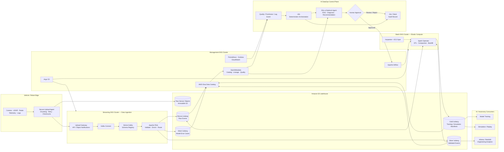
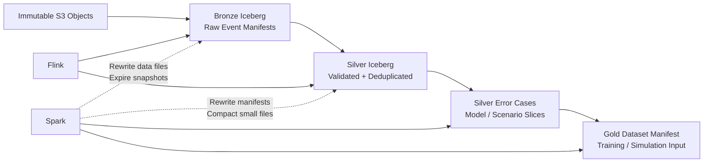
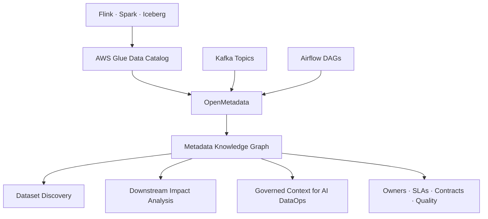
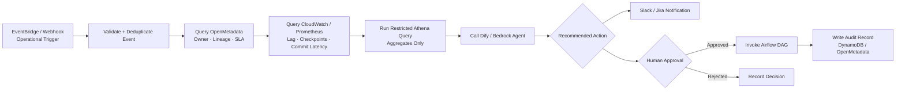
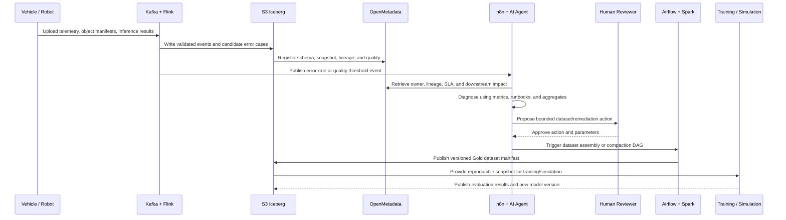
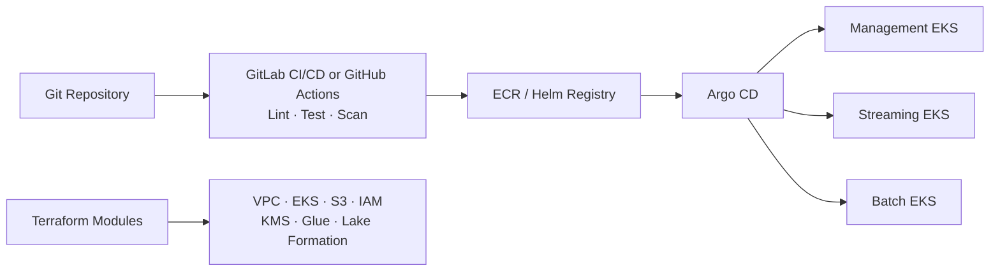

# Autonomous-Driving AI Data Infrastructure on EKS

## Production-Grade Closed-Loop Pipeline: Vehicle Upload to Model-Ready Dataset

This document extends the EKS data-mesh design in [`datamesh_eks.md`](datamesh_eks.md) into a role-aligned reference architecture for autonomous-driving and embodied-AI data infrastructure. It covers the complete path from onboard event upload through cloud preprocessing, Apache Iceberg dataset production, model-training and simulation inputs, error-case discovery, and closed-loop remediation.

The design keeps two very different workloads separate:

- The **data plane** moves and processes high-volume sensor and telemetry data using Kafka, Flink, Spark, S3, and Apache Iceberg.
- The **AI DataOps control plane** uses OpenMetadata, n8n, Dify or Amazon Bedrock, and approval-gated Airflow workflows to diagnose incidents and coordinate safe remediation.

> **Important:** n8n and Dify never sit in the petabyte-scale data path. They consume operational events, metadata, lineage, quality results, and carefully restricted aggregates—not raw sensor streams.

---

## 1. Engineering Objectives

The platform is designed around the requirements that make autonomous-driving pipelines difficult:

1. **High-throughput ingestion** of vehicle telemetry, perception results, logs, and error cases.
2. **Low-latency stream processing** for validation, enrichment, deduplication, and routing.
3. **Reliable lakehouse storage** with schema evolution, snapshots, partition evolution, and concurrent readers and writers.
4. **Efficient dataset production** for model training, simulation, evaluation, and debugging.
5. **Closed-loop workflows** that turn model failures into governed retraining datasets.
6. **End-to-end lineage** from source topic and model version to training manifest and downstream consumer.
7. **Operational resilience** through workload isolation, backpressure, replay, idempotency, observability, and controlled recovery.
8. **Cost efficiency** through tiered storage, elastic Spark execution, compaction, retention, and compute isolation.

---

## 2. End-to-End Architecture



---

## 3. Data-Plane Responsibilities

| Component | Primary responsibility | Why it belongs here |
|---|---|---|
| Secure upload agent | Chunking, checksums, retries, resumable upload, local buffering | Vehicles and robots may have intermittent connectivity. Upload must survive disconnects without duplicating objects. |
| Amazon S3 raw zone | Immutable large sensor objects | Video, images, LiDAR frames, and large logs should not be placed directly inside Kafka messages. |
| Kafka / Strimzi | Durable ordered event transport and replay | Carries object references, telemetry, model results, control events, and data-quality events. |
| Kafka Connect | Source/sink integration and standardized movement | Decouples ingestion adapters from stream-processing logic. |
| Apache Flink | Stateful validation, deduplication, enrichment, windowing, and routing | Provides low-latency processing with checkpoints and event-time semantics. |
| Apache Iceberg on S3 | Versioned analytical datasets | Supports reliable table commits, schema evolution, snapshots, partition evolution, and multiple compute engines. |
| Apache Spark | Large-scale transformation, compaction, backfill, and dataset assembly | Handles elastic batch work without destabilizing the long-running streaming cluster. |
| Airflow | Dependency-aware orchestration | Coordinates compaction, backfills, quality gates, and training-manifest publication. |

### Large Objects vs. Event Metadata

Kafka events should point to sensor objects rather than carrying multi-megabyte payloads:

```json
{
  "event_id": "evt-01JZXPENG8W1B7V2K5NQ",
  "vehicle_id": "vehicle-1042",
  "event_time": "2026-07-14T18:30:42.183Z",
  "sensor_type": "camera_front",
  "object_uri": "s3://autonomy-raw/2026/07/14/vehicle-1042/frame-837142.jpg",
  "object_checksum": "sha256:8fb8...",
  "model_version": "perception-v17",
  "frame_id": "frame-837142",
  "confidence": 0.41,
  "error_type": "pedestrian_false_negative",
  "region": "us-west",
  "schema_version": 1
}
```

This keeps Kafka efficient while preserving a durable link between operational events and immutable sensor evidence.

---

## 4. Topic and Data-Contract Design

### Suggested Kafka Topics

| Topic | Content | Retention / handling |
|---|---|---|
| `vehicle.telemetry.v1` | Vehicle state, health, location region, and timestamps | Medium retention; partition by hashed vehicle ID |
| `sensor.object-manifest.v1` | S3 object references, checksums, sensor type, and capture metadata | Long enough to support replay and reconciliation |
| `perception.inference.v1` | Model inference results and confidence | Medium retention; keyed by frame or sequence ID |
| `perception.error-cases.v1` | False positives, false negatives, low-confidence cases | Longer retention; feeds error-case mining |
| `pipeline.quality-events.v1` | Schema, freshness, null, range, and duplication failures | Compact operational events only |
| `pipeline.operations.v1` | Compaction, replay, quarantine, and backfill state | Compacted topic for current operational state |

### Contract Rules

- Every event has an immutable `event_id`, `event_time`, `schema_version`, and source identifier.
- Producers use backward-compatible schema evolution by default.
- Consumers reject incompatible versions into a quarantine topic instead of silently dropping them.
- Personally identifiable or sensitive location data is tokenized, generalized, or excluded according to policy.
- Payload and object checksums support reconciliation between Kafka and S3.
- Idempotency keys prevent duplicate processing after retries or checkpoint recovery.

---

## 5. Iceberg Lakehouse Design



### Table Examples

```text
bronze.vehicle_telemetry
bronze.sensor_object_manifest
bronze.perception_inference

silver.validated_telemetry
silver.validated_perception
silver.model_error_cases
silver.quarantined_events

gold.training_dataset_manifest
gold.simulation_scenario_manifest
gold.model_evaluation_metrics
```

### Iceberg Capabilities to Demonstrate

1. **Schema evolution:** Add a new sensor or model attribute without rewriting the entire table.
2. **Partition evolution:** Move from day-based partitioning to day-plus-region or model-version partitioning as access patterns change.
3. **Snapshot isolation:** Allow training and simulation jobs to consume a reproducible dataset snapshot while ingestion continues.
4. **Time travel:** Reproduce a previous model-training input or investigate when bad data entered the lake.
5. **Compaction:** Rewrite small files generated by streaming ingestion into efficient analytical file sizes.
6. **Snapshot expiration:** Retain required reproducibility while removing obsolete metadata and orphaned files under policy.
7. **Optimistic concurrency:** Support Flink ingestion, Spark maintenance, and analytical readers without corrupting table state.

### Dataset Reproducibility

Every training manifest should record:

```json
{
  "dataset_id": "pedestrian-errors-2026-07-14-v3",
  "iceberg_table": "gold.training_dataset_manifest",
  "source_snapshot_ids": {
    "silver.validated_perception": 739118220981,
    "silver.model_error_cases": 739118221427
  },
  "model_source_version": "perception-v17",
  "selection_policy_version": "error-miner-v3",
  "created_at": "2026-07-14T22:00:00Z",
  "quality_status": "APPROVED"
}
```

That manifest creates an auditable link between input data, model version, selection logic, and the resulting training run.

---

## 6. Streaming Processing and Error-Case Mining

Flink consumes telemetry, object manifests, and inference events and maintains short-lived keyed state.

### Processing Sequence

1. Validate the event against its registered schema.
2. Verify required identifiers, timestamps, and object references.
3. Deduplicate by `event_id` and `frame_id` within the configured state window.
4. Join inference results with vehicle, model, and scenario context.
5. Apply event-time windows and watermarks for late data.
6. Write raw validated events to Bronze and conformed records to Silver.
7. Route low-confidence results and known failure patterns into `silver.model_error_cases`.
8. Publish a compact quality or anomaly event when thresholds are exceeded.

### Example Error-Case Rules

- Confidence below a model-specific threshold
- Disagreement between production and shadow model
- Sudden increase in false-negative labels
- Missing or corrupt sensor object
- Time synchronization drift between sensors
- Scenario underrepresentation by weather, lighting, road class, or region
- Schema or model-version mismatch

The rules create candidate cases. Human review and downstream quality gates determine whether those cases become training data.

---

## 7. Metadata, Lineage, and Data Products



OpenMetadata provides the context an AI workflow cannot safely infer from raw tables alone:

- Dataset owner and responsible team
- Source topic and upstream application
- Table schema and business meaning
- Freshness, volume, and quality results
- Upstream and downstream lineage
- Sensitive-data classification
- Training jobs, models, dashboards, and simulations that depend on the asset
- Runbooks and previous incident decisions

This context lets the AI workflow answer, "What breaks if this table is late?" before suggesting an action.

---

## 8. AI DataOps Control Plane

The AI control plane is event-driven and approval-gated. It assists operators but does not bypass production controls.

### Operational Event

```json
{
  "event_type": "DATA_QUALITY_FAILURE",
  "severity": "HIGH",
  "table": "silver.model_error_cases",
  "failed_rule": "confidence_score_range",
  "failure_count": 18243,
  "iceberg_snapshot_id": 739118221427,
  "openmetadata_fqn": "iceberg.autonomy.silver.model_error_cases",
  "observed_at": "2026-07-14T20:15:00Z"
}
```

### n8n Workflow



Recommended n8n nodes or integrations:

1. EventBridge, SQS, or authenticated webhook trigger
2. JSON Schema validation
3. Idempotency lookup in DynamoDB
4. OpenMetadata REST API request
5. CloudWatch or Prometheus metric request
6. Restricted Athena query through a service role
7. Dify API or Amazon Bedrock invocation
8. Structured-output validation
9. Slack or Jira notification
10. Human approval callback
11. Airflow REST API invocation
12. Audit-record persistence

### Dify or Bedrock Agent

The reasoning layer receives a bounded evidence package:

```text
Operational event
+ dataset metadata
+ upstream/downstream lineage
+ recent quality history
+ pipeline metrics
+ approved runbooks
+ restricted aggregate query results
```

It returns structured output rather than free-form instructions:

```json
{
  "severity": "HIGH",
  "probable_cause": "Flink recovery produced excessive small Iceberg files in three hourly partitions",
  "confidence": 0.87,
  "affected_assets": [
    "silver.model_error_cases",
    "gold.training_dataset_manifest"
  ],
  "recommended_action": "Run targeted Iceberg compaction for the affected partitions",
  "airflow_dag": "compact_model_error_cases",
  "dag_parameters": {
    "partition_start": "2026-07-14T17:00:00Z",
    "partition_end": "2026-07-14T20:00:00Z"
  },
  "requires_approval": true
}
```

### Knowledge Base

The Dify or Bedrock knowledge base contains:

- Kafka and Flink operating procedures
- Iceberg compaction and snapshot-retention policies
- Data contracts and schema documentation
- Airflow DAG documentation
- Incident-response runbooks
- Dataset ownership and escalation paths
- Previous approved remediation decisions

---

## 9. Autonomous-Driving Closed Loop



### Closed-Loop Steps

1. A vehicle uploads sensor objects and inference metadata.
2. Kafka and Flink validate, enrich, and route the event.
3. Candidate model failures are written to a governed Iceberg error-case table.
4. A threshold violation generates a compact operational event.
5. n8n collects lineage, metrics, quality history, and runbook context.
6. Dify or Bedrock produces a diagnosis and proposed dataset-selection action.
7. A human reviewer approves the scope and parameters.
8. Airflow launches a Spark job to assemble and validate a versioned training manifest.
9. Training or simulation consumes a pinned Iceberg snapshot.
10. Evaluation results and the new model version return to the lakehouse, completing the loop.

---

## 10. Reliability and Performance Engineering

### Kafka

- Partition topics using stable high-cardinality keys while avoiding hot partitions.
- Use replication across Availability Zones and monitor in-sync replica health.
- Apply producer idempotency and appropriate acknowledgment settings.
- Control message size by storing large sensor objects in S3.
- Monitor consumer lag, rebalance frequency, under-replicated partitions, and disk utilization.
- Use replayable topics and explicit data-retention policies.

### Flink

- Use event time and watermarks to handle late vehicle uploads.
- Store checkpoints in durable S3 storage.
- Size state backends and checkpoint intervals from measured workloads.
- Isolate backpressure and route poison records to quarantine.
- Verify recovery-point and recovery-time objectives with failure injection.

### Iceberg and S3

- Measure commit latency, file counts, manifest growth, and average file size.
- Compact streaming-created files to target sizes appropriate for Spark and Athena scans.
- Coordinate snapshot expiration with training reproducibility requirements.
- Use deterministic idempotency keys and reconciliation for Kafka-to-Iceberg delivery.
- Track orphan files and failed commits without deleting active snapshot data.

### Spark

- Use Karpenter and EC2 Spot for elastic, restartable jobs.
- Keep critical metadata and orchestration services off the batch cluster.
- Tune shuffle partitions, executor sizing, and adaptive query execution using measured input sizes.
- Scope compaction to affected partitions rather than rewriting entire tables.

---

## 11. Observability and Service-Level Objectives

| Signal | Example measurement | Operational use |
|---|---|---|
| Ingestion throughput | Records/sec and bytes/sec by topic | Capacity planning and regression detection |
| End-to-end freshness | Vehicle event time to Silver commit time | User-facing data SLA |
| Kafka lag | Lag by topic, partition, and consumer group | Backpressure and stuck-consumer detection |
| Flink health | Checkpoint duration/failure, restart count, backpressure | Stateful processing reliability |
| Iceberg health | Commit latency, file count, average file size, manifests/snapshot | Compaction and metadata-growth control |
| Data quality | Nulls, duplicates, schema failures, range failures | Dataset trust and quarantine decisions |
| Training readiness | Approved error cases and manifest publication time | Closed-loop iteration speed |
| Cost efficiency | Cost per TB ingested and cost per dataset produced | Architecture and capacity optimization |

Example SLOs should be based on measured tests, not assumed numbers:

- 99.9% successful pipeline availability during the evaluation window
- P95 event-to-Silver freshness within the selected operational target
- Zero untracked schema changes in governed production topics
- Reproducible training manifests tied to immutable Iceberg snapshot IDs
- All AI-recommended production actions recorded and human-approved

---

## 12. Security and Governance

- Use separate AWS accounts for platform, data domains, security, and workloads.
- Use IAM roles for service accounts for EKS workloads; avoid static AWS credentials.
- Encrypt Kafka traffic with TLS/mTLS and S3 data with KMS-managed keys.
- Use Lake Formation for table-, column-, and domain-level access controls.
- Keep sensitive raw sensor data out of AI prompts.
- Allow the AI workflow to query only approved aggregates and metadata.
- Store secrets in AWS Secrets Manager and rotate them through controlled automation.
- Record every agent recommendation, human decision, Airflow invocation, and resulting dataset snapshot.
- Use VPC endpoints and restricted egress for data-plane and control-plane services.
- Apply retention, residency, and deletion policies by region and data classification.

### AI Safety Boundary

The AI agent may:

- Summarize evidence
- Retrieve metadata and approved runbooks
- Identify downstream impact
- Recommend a known remediation
- Prepare bounded Airflow parameters

The AI agent may not:

- Read unrestricted raw sensor data
- Modify production Iceberg tables directly
- Change IAM or Lake Formation permissions
- Trigger destructive snapshot or object deletion
- Run arbitrary SQL or shell commands
- Bypass human approval for production actions

---

## 13. Deployment and GitOps



### Repository Layout

```text
ai-dataops-closed-loop/
├── README.md
├── architecture/
│   ├── data-plane.md
│   └── ai-control-plane.md
├── infrastructure/
│   ├── terraform/
│   └── helm/
├── kafka/
│   ├── topics/
│   └── synthetic-producer/
├── flink/
│   └── telemetry-pipeline/
├── spark/
│   ├── iceberg-compaction/
│   └── training-manifest/
├── metadata/
│   └── openmetadata/
├── orchestration/
│   ├── airflow/
│   └── n8n-workflows/
├── ai/
│   ├── dify/
│   ├── prompts/
│   └── runbooks/
├── observability/
│   ├── prometheus/
│   └── grafana/
├── tests/
└── benchmark-results/
```

---

## 14. Practical Implementation Plan

### Phase 1 — Runnable Vertical Slice

- Generate synthetic vehicle telemetry and perception events.
- Create Kafka topics and schemas.
- Build one Flink job that validates and writes Bronze/Silver Iceberg tables.
- Query the resulting tables through Athena or Spark SQL.
- Demonstrate replay and deduplication.

### Phase 2 — Lakehouse Operations

- Implement Spark compaction for selected partitions.
- Demonstrate schema and partition evolution.
- Pin a training manifest to specific Iceberg snapshot IDs.
- Add data-quality checks and a quarantine table.

### Phase 3 — Metadata and Observability

- Register Iceberg tables in Glue.
- Ingest Glue, Kafka, and Airflow metadata into OpenMetadata.
- Add Prometheus and Grafana dashboards for Kafka, Flink, Spark, and Iceberg health.
- Define measured freshness and recovery targets.

### Phase 4 — AI DataOps Workflow

- Export an n8n workflow that handles one quality-failure scenario.
- Build a Dify or Bedrock knowledge base from runbooks and metadata.
- Produce JSON-schema-validated diagnostic output.
- Add Slack or Jira notification and human approval.
- Trigger an allow-listed Airflow DAG after approval.

### Phase 5 — Evidence and Benchmarking

- Publish the exact test environment and configuration.
- Record event size, partition count, broker count, Flink parallelism, and duration.
- Report sustained throughput, P95 latency, checkpoint behavior, and resource usage.
- Capture a failure-and-recovery test.
- Include screenshots and a short demonstration video.

> Do not claim a throughput number such as **1M+ records/second** unless the repository contains a reproducible benchmark proving it.

---

## 15. Definition of Done

The project is credible when another engineer can:

1. Deploy or run the documented vertical slice.
2. Produce synthetic telemetry into Kafka.
3. Observe Flink writing valid Iceberg Bronze and Silver records.
4. Query a reproducible Iceberg snapshot.
5. Trigger a documented quality failure.
6. See n8n collect metadata and operational evidence.
7. Receive structured AI diagnosis from Dify or Bedrock.
8. Approve a bounded remediation.
9. Observe Airflow launch the Spark job.
10. Verify the resulting dataset manifest and lineage in OpenMetadata.

Recommended repository evidence:

- Terraform and Helm definitions
- Kafka topic and schema definitions
- Synthetic producer code
- Flink and Spark source code with tests
- Iceberg table DDL and maintenance procedures
- n8n workflow JSON export
- Dify application export or Bedrock agent configuration
- Airflow remediation DAG
- OpenMetadata configuration and lineage screenshots
- Grafana dashboards
- Benchmark methodology and measured results

---

## 16. Technology Stack Summary

| Layer | Technology |
|---|---|
| Edge upload | Resumable HTTPS upload, checksums, local buffering |
| Event streaming | Strimzi Kafka, Kafka Connect, Schema Registry |
| Real-time processing | Apache Flink |
| Object and table storage | Amazon S3, Apache Iceberg |
| Batch and maintenance | Apache Spark, Spark Operator, Karpenter, EC2 Spot |
| Orchestration | Apache Airflow |
| Metadata and lineage | AWS Glue Data Catalog, OpenMetadata |
| Governance | AWS Lake Formation, IAM, KMS |
| Containers and platform | Amazon EKS, Docker, Helm, Argo CD |
| Infrastructure as Code | Terraform, CloudFormation |
| Observability | Prometheus, Grafana, CloudWatch |
| AI workflow orchestration | n8n |
| AI reasoning and RAG | Dify or Amazon Bedrock, OpenSearch |
| Analytical consumption | Athena, Redshift, Spark SQL |
| Engineering languages | Python, Java, Scala, SQL, Bash |

---

## 17. Interview Summary

> *"I separate the high-volume data plane from the AI operations control plane. Vehicle telemetry and sensor-object manifests flow through Kafka and Flink into governed S3 Iceberg Bronze and Silver tables. Spark provides elastic compaction, backfills, and versioned training-dataset assembly, while Glue and OpenMetadata preserve schema, lineage, ownership, and quality context. Operational failures trigger n8n, which gathers bounded evidence and calls a Dify or Bedrock agent for structured diagnosis. Any production remediation remains allow-listed, audited, and human-approved before Airflow executes it. The result is a reliable closed loop from vehicle data to reproducible model-training and simulation inputs without placing low-code or LLM tools in the petabyte-scale data path."*
