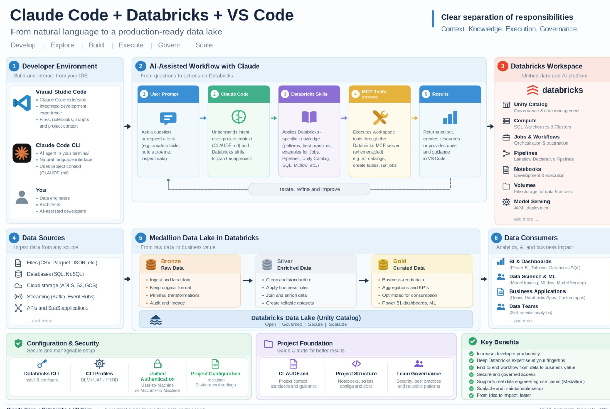

# Claude Code + Databricks + VS Code — a practical architecture

*From natural language to a production-ready data lake*

**Focus areas:** Develop · Explore · Build · Execute · Govern · Scale

Source diagram: [alexeyban/databricks-lab](https://github.com/alexeyban/databricks-lab)



## Overview

This page describes an end-to-end architecture for integrating **Claude Code** into a **Databricks** development workflow — from the developer environment and project configuration, through workspace execution, to a Medallion-based data pipeline.

The architecture keeps a clear separation of responsibilities:

| Component | Role |
|---|---|
| **Claude Code** | Reasoning, planning, and project context |
| **Databricks Skills** | Official Databricks agent skills (installed via `databricks aitools install`) that bring Databricks-specific patterns, best practices, and implementation guidance for Jobs, Pipelines, Unity Catalog, SQL, and MLflow — they teach the agent **how** to work with Databricks |
| **MCP tools** *(optional)* | An execution layer that, when enabled and authorized, lets the agent **act** on Databricks resources instead of only generating code |
| **Unified Authentication & environment profiles** | Determine the workspace, identity, and permissions used during execution |
| **CLAUDE.md, project structure & governance rules** | Provide project context, standards, and guardrails |

The interaction can go beyond code generation: with the right execution tools and permissions, a single prompt can lead the agent to inspect the workspace, understand existing resources, generate implementation artifacts, create or update Jobs and Pipelines, execute workloads, and validate results.

## The engineering loop

```
Inspect → Plan → Generate → Deploy → Execute → Validate
```

This loop connects the agentic workflow to the Data Engineering lifecycle below it:

```
Data Sources → Bronze → Silver → Gold → Data Consumers
```

The goal isn't to remove engineering decisions from the process — it's to let the agent participate in more of the development lifecycle while environment isolation, authentication, compute decisions, permissions, governance, and validation stay under control.

## 1. Developer Environment

*Build and interact from your IDE*

- **Visual Studio Code** — Claude Code extension, integrated development experience, files/notebooks/scripts and project context
- **Claude Code CLI** — AI agent in your terminal, natural language interface, uses project context (`CLAUDE.md`)
- **You** — data engineers, architects, AI-assisted developers

## 2. AI-Assisted Workflow with Claude

*From questions to actions on Databricks*

1. **User Prompt** — ask a question or request a task (e.g. create a table, build a pipeline, inspect data)
2. **Claude Code** — understands intent, uses project context (`CLAUDE.md`) and Databricks skills to plan the approach
3. **Databricks Skills** — applies Databricks-specific knowledge (patterns, best practices, examples for Jobs, Pipelines, Unity Catalog, SQL, MLflow, etc.)
4. **MCP Tools** *(optional)* — executes workspace tools through the Databricks MCP server (when enabled), e.g. list catalogs, create tables, run jobs
5. **Results** — returns output, creates resources, or provides code and guidance in VS Code

This cycle is designed to **iterate, refine, and improve**.

## 3. Databricks Workspace

*Unified data and AI platform*

- **Unity Catalog** — governance and data management
- **Compute** — SQL Warehouses & Clusters
- **Jobs & Workflows** — orchestration and automation
- **Pipelines** — Lakeflow Declarative Pipelines
- **Notebooks** — development and execution
- **Volumes** — file storage for data and assets
- **Model Serving** — AI/ML deployment
- ...and more

## 4. Data Sources

*Ingest data from any source*

- Files (CSV, Parquet, JSON, etc.)
- Databases (SQL, NoSQL)
- Cloud storage (ADLS, S3, GCS)
- Streaming (Kafka, Event Hubs)
- APIs and SaaS applications
- ...and more

## 5. Medallion Data Lake in Databricks

*From raw data to business value*

| Layer | Purpose | Activities |
|---|---|---|
| **Bronze** — Raw Data | Landing zone | Ingest and land data, keep original format, minimal transformations, audit and lineage |
| **Silver** — Enriched Data | Cleansing & enrichment | Clean and standardize, apply business rules, join and enrich data, create reliable datasets |
| **Gold** — Curated Data | Business-ready | Business-ready data, aggregations and KPIs, optimized for consumption, powers BI/dashboards/ML |

All layers sit on the **Databricks Data Lake (Unity Catalog)** — open, governed, secure, scalable.

The Medallion example is intentionally simple, but the same approach extends to more complex Databricks workloads.

## 6. Data Consumers

*Analytics, AI, and business impact*

- **BI & Dashboards** — Power BI, Tableau, Databricks SQL
- **Data Science & ML** — model training, MLflow, Model Serving
- **Business Applications** — Genie, Databricks Apps, custom apps
- **Data Teams** — self-service analytics
- ...and more

## Configuration & Security

*Secure and manageable setup*

- **Databricks CLI** — install & configure
- **CLI Profiles** — DEV / UAT / PROD
- **Unified Authentication** — user-to-machine or machine-to-machine
- **Project Configuration** — `.mcp.json`, environment settings

## Project Foundation

*Guide Claude for better results*

- **CLAUDE.md** — project context, standards, and guidance
- **Project Structure** — notebooks, scripts, configs, docs
- **Team Governance** — security, best practices, reusable patterns

### Claude Code project structure

A typical repo layout that gives Claude Code the context, skills, and guardrails it needs to work effectively against Databricks:

```
project-root/
├── CLAUDE.md                     # Project context, conventions, and guardrails
│                                  # Claude reads this automatically on every session
├── .mcp.json                     # MCP server config (e.g. Databricks MCP server,
│                                  # auth profile, allowed tool scopes)
├── .claude/
│   ├── skills/                   # Agent Skills — reusable, model-invoked capabilities
│   │   ├── databricks-jobs/      # e.g. installed via `databricks aitools install`
│   │   ├── databricks-pipelines/ #   or authored in-house
│   │   ├── unity-catalog/
│   │   ├── sql-warehouses/
│   │   ├── mlflow/
│   │   └── <team-custom-skill>/  # Org-specific patterns (naming, lineage, testing)
│   ├── commands/                 # Custom slash commands (/deploy-job, /run-pipeline...)
│   ├── agents/                   # Subagent definitions for specialized tasks
│   └── settings.json             # Permissions, tool allow/deny lists, hooks
├── notebooks/                    # Databricks notebooks (Bronze/Silver/Gold logic)
├── src/                          # Shared code — transformations, utils, DLT pipelines
├── jobs/                         # Job/workflow definitions (YAML/JSON, asset bundles)
├── pipelines/                    # Lakeflow Declarative Pipeline definitions
├── tests/                        # Unit/integration tests for pipeline logic
├── configs/                      # Environment configs (DEV / UAT / PROD)
└── docs/                         # Architecture notes, runbooks, governance docs
```

**Key pieces:**

- **`CLAUDE.md`** — the single most important file for context: describes the project, coding standards, Databricks conventions, and any guardrails (e.g. "never write directly to Gold", "always use Unity Catalog three-level namespacing").
- **Skills (`.claude/skills/`)** — packaged, reusable instructions the agent loads only when relevant (e.g. a Databricks Jobs skill, a Unity Catalog skill, an MLflow skill). Official Databricks skills are installed via `databricks aitools install`; teams can add their own alongside them for org-specific patterns.
- **`.mcp.json`** — declares which MCP servers (e.g. the Databricks MCP server) are available, and under what authentication profile and permission scope — this is what turns Claude from "generates code" into "can act on the workspace."
- **Commands (`.claude/commands/`)** — shortcuts for repeatable multi-step workflows (deploy a job, run a pipeline, validate a table).
- **`settings.json`** — permission boundaries: which tools/commands Claude is allowed to run without approval, and any hooks for logging or validation.

## Key Benefits

- Increase developer productivity
- Deep Databricks expertise at your fingertips
- End-to-end workflow from data to business value
- Secure and governed access
- Supports real data engineering use cases (Medallion)
- Scalable and maintainable setup
- From idea to impact, faster

---
*Note: the MCP execution layer is optional. Implementation should follow current Databricks guidance and each organization's engineering and security standards.*
