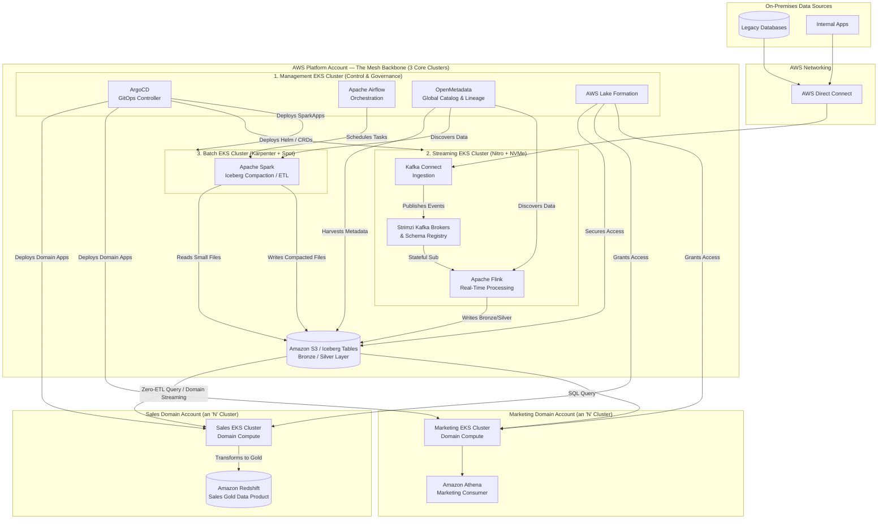
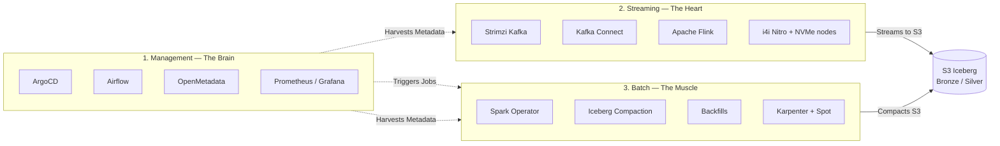
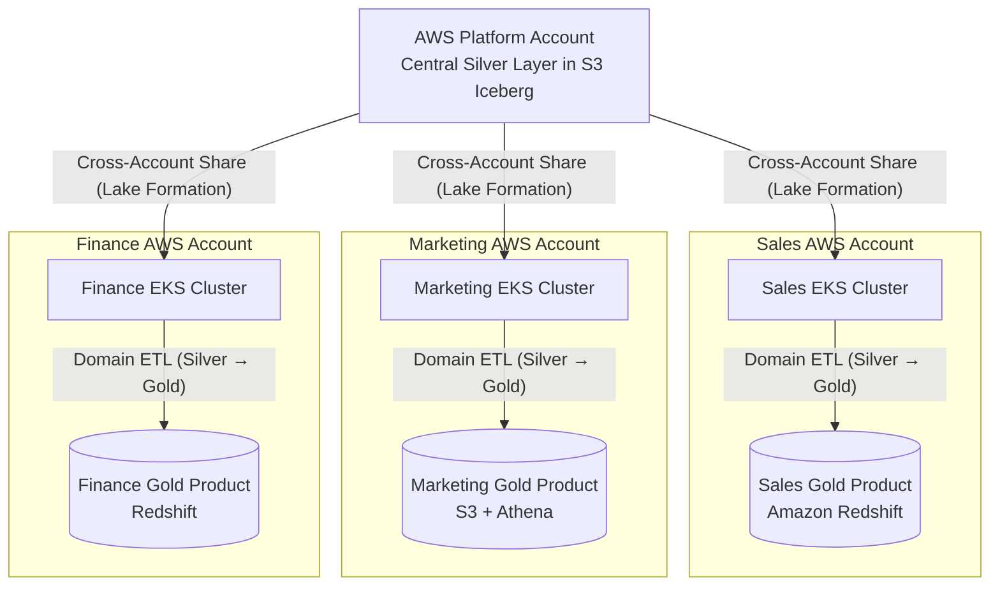
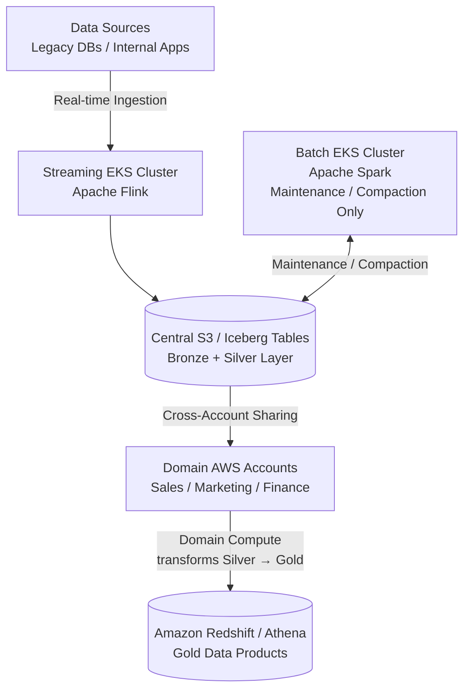
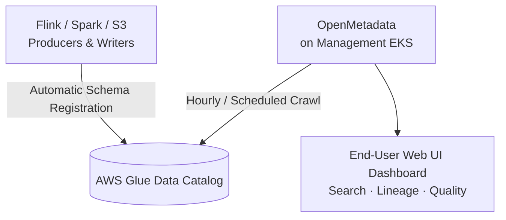

# Data Mesh on EKS — The "3+N" Cluster Architecture

A production-grade Data Mesh built on Amazon EKS, designed to ingest **1M+ records/second** while keeping streaming, batch, and governance workloads isolated. The platform team operates **3 core clusters** (Management, Streaming, Batch) and federates compute out to **N domain clusters** (Sales, Marketing, Finance) owned by the business domains themselves.

---

## 1. High-Level Architecture

The platform splits responsibilities between a central **AWS Platform Account** (the "Mesh Backbone") and one or more **Domain AWS Accounts** that own their own Gold data products.

---

## 2. Why a 3-Cluster Backbone?

Running Kafka, Spark, and OpenMetadata in the **same** Kubernetes cluster will cause them to fight for resources, exhaust the VPC IP space, and crash the Kubernetes API server. Isolating workloads by their *failure mode* and *scaling profile* is the core idea.

### Cluster Responsibilities at a Glance

| Cluster | Persona | Workloads | Scaling Profile | Why Isolate |
|---|---|---|---|---|
| **Management** | The Brain | ArgoCD, Airflow, OpenMetadata, Prom/Grafana | Static, modest, long-running | Must never go down — a runaway Spark job cannot be allowed to crash the scheduler or catalog. Platform admins only. |
| **Streaming** | The Heart | Strimzi Kafka, Kafka Connect, Flink | Static nodes, pods run for months | Needs AWS Nitro + NVMe (i4i) for sequential I/O. Kafka brokers are intolerant of network jitter — a noisy neighbor breaks ISR and Flink checkpoints. |
| **Batch** | The Muscle | Spark (via Spark Operator), Iceberg compaction, backfills | Hyper-elastic, 0 → thousands of pods → 0 | Uses EC2 Spot for cost. Heavy etcd pressure when Spark requests 2,000 executor pods — isolation prevents "Control Plane Exhaustion." |

---

## 3. The "N" Domain Clusters (Decentralized Mesh)

Once the platform team has built the 3 core clusters, **ArgoCD spins up dedicated EKS clusters inside each domain's own AWS account**. Each domain owns its compute, its Gold Data Products, and its bill.

This gives each domain freedom to write their own Flink and Spark code, query OpenMetadata, and — crucially — **pay for their own compute**, completely isolating their mistakes from the central pipeline.

---

## 4. The Data Pipeline (Bronze → Silver → Gold)

A common misconception is that the Batch cluster creates the Gold layer. **It does not.** Responsibilities are split between the central Platform team and the domain teams.

### Step-by-Step

1. **Streaming EKS Cluster (Flink):** Consumes raw events from Kafka and writes them directly into the central **S3 Iceberg Tables** as Bronze/Silver.
2. **Batch EKS Cluster (Spark):** Behaves like a *janitor*, not a transformer. It sees all the tiny files Flink is generating, **compacts them** into larger files, and exits. It does **not** touch or create Gold data.
3. **Domain AWS Accounts (Sales, Marketing, Finance):** This is where Gold is made. Each domain pulls clean Silver data, applies its own business logic, and materializes its **Gold Data Products** in its own Redshift cluster or S3 + Athena environment.

---

## 5. Metadata Flow (How Governance Actually Works)

OpenMetadata runs on the **Management** cluster — but the Batch cluster is **not** the one pushing metadata to it. Instead, **AWS Glue is the central engine** and OpenMetadata is the viewer.

### How Metadata Actually Moves

1. **Tables talk to Glue.** When Flink writes data or when the Batch Spark cluster compacts files, they register schemas and partition updates directly to **AWS Glue Data Catalog**.
2. **OpenMetadata ingests from Glue.** A scheduled connector on the Management cluster pulls schemas, table names, and lineage from Glue and indexes them into its own database.
3. **End users hit OpenMetadata.** They search for data, view lineage, and check data quality through the OpenMetadata web UI.

**Key takeaway:** The Batch EKS cluster does not "manage" metadata. Storage layers update Glue automatically; OpenMetadata aggregates Glue into a single enterprise catalog.

---

## 6. The Summary One-Liner

> *"Our Streaming EKS cluster handles real-time ingestion directly into the Central S3 Silver layer as Iceberg tables. The Batch EKS cluster is dedicated purely to table maintenance — Spark compaction jobs on that Silver layer to solve the small-file problem. The data is then federated out to Domain AWS Accounts, where domain-specific compute transforms Silver into Gold Data Products inside their own Redshift or Athena environments. For governance, all schemas are registered centrally in AWS Glue, which is automatically scraped by OpenMetadata running on our Management Cluster to provide an enterprise-wide data catalog."*

---

## 7. Technology Stack Summary

| Layer | Technology |
|---|---|
| Orchestration / GitOps | ArgoCD, Apache Airflow |
| Streaming | Strimzi Kafka, Kafka Connect, Apache Flink |
| Batch / ETL | Apache Spark (Spark Operator), Karpenter, EC2 Spot |
| Storage | Amazon S3 + Apache Iceberg (Bronze / Silver) |
| Domain Analytics | Amazon Redshift, Amazon Athena |
| Governance | AWS Glue Data Catalog, AWS Lake Formation, OpenMetadata |
| Observability | Prometheus, Grafana |
| Networking | AWS Direct Connect |
| Compute (Streaming) | AWS Nitro instances (i4i with NVMe Instance Store) |
