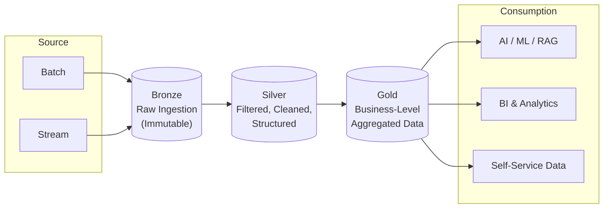
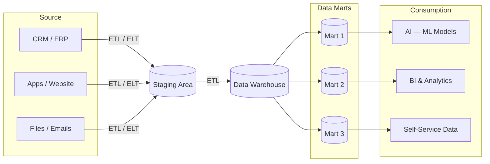
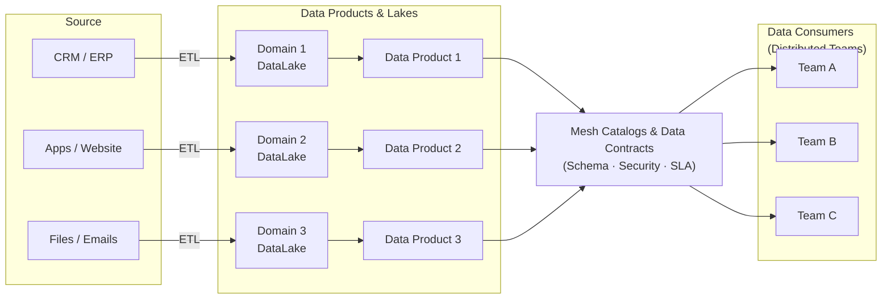
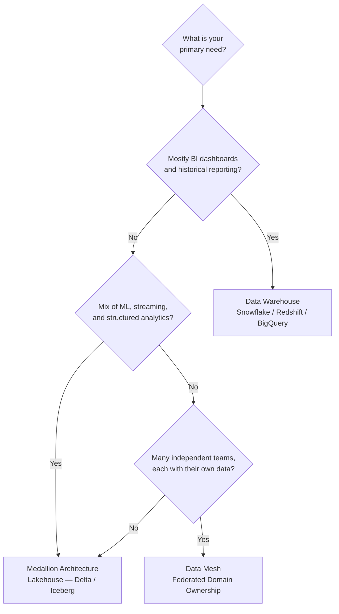
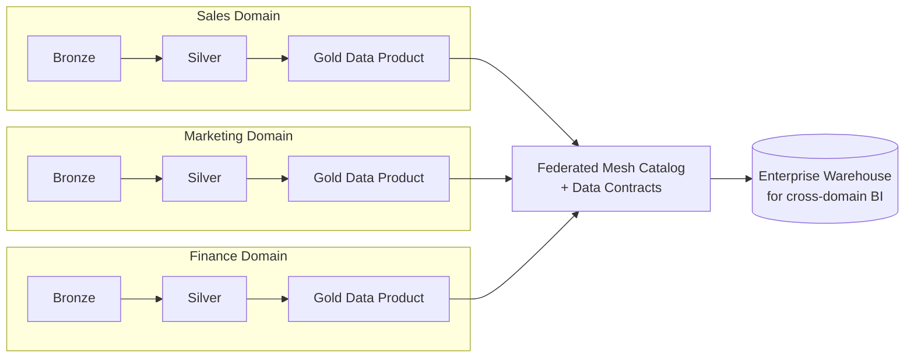

# Medallion vs Data Warehouse vs Data Mesh

A side-by-side comparison of three foundational data platform architectures: **Medallion Architecture**, **Data Warehouse**, and **Data Mesh**. Each solves the same problem — turning raw operational data into business-ready insights — but they make very different choices about *where* data lives, *who* owns it, and *how* it flows.

---

## 1. Medallion Architecture

Data is organized into progressive layers (**Bronze → Silver → Gold**) to ensure data quality, structure, and preparation for analytics & machine learning.

**How it works:** Raw events from batch and streaming sources land in **Bronze** as immutable history. **Silver** cleans, deduplicates, and conforms the data. **Gold** aggregates it into analytics-ready, business-level tables that power AI/ML, BI dashboards, and self-service consumption.

---

## 2. Data Warehouse

Centralized, optimized storage for integrated, clean, and historical data — ready for reporting and advanced analytics.

**How it works:** Source systems (CRM/ERP, web apps, files) are pulled by **ETL/ELT** into a **Staging Area**, then transformed into the central **Data Warehouse**. Subject-specific **Data Marts** carve the warehouse into focused slices for AI/ML, BI, and ad-hoc analytics.

---

## 3. Data Mesh

Decentralized ownership by **domain teams**. Each domain publishes trusted **data products** with interoperability and federated governance via shared standards.

**How it works:** Each business domain (Sales, Marketing, Finance, etc.) owns its own data lake and publishes **data products** as a first-class deliverable. A central **Mesh Catalog** registers every product alongside its data contract — schema, security policy, SLA — and **distributed consumer teams** discover and subscribe to products through that catalog.

---

## 4. Side-by-Side Comparison

| Point | Medallion Architecture | Data Warehouse | Data Mesh |
|---|---|---|---|
| **Core Idea** | Organizes data into layers: Bronze, Silver, and Gold. | Centralizes data into one structured warehouse. | Decentralizes data ownership across business domains. |
| **Data Flow** | Raw data moves from Bronze → Silver → Gold. | Source data goes through ETL/ELT → Staging → Warehouse → Data Marts. | Each domain creates and manages its own data products. |
| **Data Ownership** | Usually managed by a central data engineering team. | Mostly controlled by central BI / data warehouse teams. | Owned by domain teams like sales, finance, product, or operations. |
| **Best Use Case** | Lakehouse, analytics, ML, and AI-ready data pipelines. | Reporting, dashboards, historical analysis, and business intelligence. | Large organizations where teams need independent data ownership. |
| **Governance Style** | Layered data quality improvement. | Centralized through warehouse rules and data models. | Federated using data contracts, catalogs, quality rules, and SLAs. |

---

## 5. How to Choose

### Rules of Thumb

- **Pick a Data Warehouse** when the work is overwhelmingly structured reporting and BI, governance is centralized, and the data volume fits comfortably in a managed warehouse engine.
- **Pick Medallion / Lakehouse** when workloads span ML, streaming, and analytics, when data is semi-structured or large-scale, and when one central data engineering team can own the pipeline.
- **Pick Data Mesh** when the organization is too large for a single team to be the bottleneck — each business domain becomes a data publisher and consumer through shared contracts and a central catalog.

---

## 6. They Are Not Mutually Exclusive

In practice, mature platforms combine all three: **Medallion is the storage pattern**, **Data Warehouse is the serving layer**, and **Data Mesh is the organizational model** layered on top.

Each domain internally uses **Medallion** (Bronze/Silver/Gold), publishes its Gold layer as a **Data Mesh** product, and the federated catalog feeds a thin **Data Warehouse** layer for cross-domain reporting. This is exactly the pattern the EKS-based platform in `datamesh_eks.md` implements.
